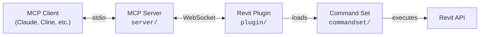
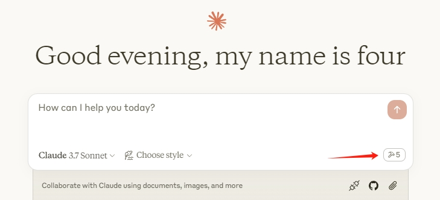

[](https://github.com/mcp-servers-for-revit/mcp-servers-for-revit)

# mcp-revit

**Connect AI assistants to Autodesk Revit via the Model Context Protocol.**

mcp-revit enables AI clients like Claude, Cline, and other MCP-compatible tools to read, create, modify, and delete elements in Revit projects. It consists of three components: a TypeScript MCP server that exposes tools to AI, a C# Revit add-in that bridges commands into Revit, and a command set that implements the actual Revit API operations.

## Provenance and license

This repository is the Desarrollos Palo Blanco fork of
[mcp-servers-for-revit](https://github.com/mcp-servers-for-revit/mcp-servers-for-revit),
which is itself a fork of the original
[revit-mcp](https://github.com/mcp-servers-for-revit/revit-mcp) project.

It is distributed under the MIT license, and the upstream copyright notices are
preserved verbatim in [LICENSE](./LICENSE). The fork was taken as a snapshot
rather than a git clone, so the upstream commit history is not present here;
this section is the record of where the code came from.

### What this fork adds

Three commands for reading and writing element parameters, so callers no longer
need `send_code_to_revit` as a workaround for parameter work:

| Tool | Scope |
| --- | --- |
| `get_parameter` | Read one parameter, or every parameter, from an element |
| `modify_element` | Write many parameters on a single element |
| `set_parameter` | Write one parameter across many elements |

All three convert values by `StorageType` (String, Integer, Double, ElementId)
and share a single transaction per call, so one undo reverts the whole
operation. Double parameters default to Revit internal units (feet);
`useDisplayUnits` routes them through `SetValueString` so callers can pass
project units instead.

They also attach an `IFailuresPreprocessor` to every writing transaction. Without
one, a warning raised during `Commit` (for example a wall overlapping a room
separation line) makes Revit show a modal dialog, which freezes the UI thread,
which freezes the external event queue, which hangs every subsequent command
until somebody clicks the dialog by hand. Warnings are recorded and dismissed so
the call completes; errors roll the transaction back. Both are reported in the
result rather than hidden.

#### Quantification commands

Seven commands for structural take-off, each one a workflow that previously had
to be written by hand and pushed through `send_code_to_revit`:

| Tool | Scope |
| --- | --- |
| `create_foundation_earthworks` | Excavation and backfill masses for foundations, as Toposolids (Revit 2024+) |
| `assign_bim_level` | Write the level a slab or beam roofs, which is the one it is quantified under |
| `classify_elements` | Assign Assembly Code by rule and derive a missing Type Mark from the type name |
| `analyze_clashes` | Find structure that overlaps without being joined, and colour it |
| `copy_ramps_as_floors` | Replicate ramps as sloped floors so they land in a slab take-off |
| `create_grid_railings` | Trace the grid with railings so the setting-out run can be measured |
| `format_schedules` | Rename schedule headings and apply one consistent look |

They share three habits worth calling out, because each one exists to stop a
silent, expensive mistake:

**They target a document by title, never the active one.** `documentTitle` is
resolved against `Application.Documents`. A command that reads
`ActiveUIDocument` can commit its edits to whichever model the user happened to
switch to while the call was queued, and nothing in the result would say so.

**They measure geometry with solid booleans, not `ReferenceIntersector`.** Ray
casting only sees what is visible in the view it is handed, so the same question
gets different answers after someone moves a section box. Booleans are
reproducible, and with a bounding-box prefilter they are also far faster.

**They attach the same `IFailuresPreprocessor` as the parameter commands**, so a
warning during `Commit` never leaves Revit sitting on a modal dialog with nobody
there to click it.

Two details inside `create_foundation_earthworks` are the difference between a
plausible number and a correct one. The excavation ceiling is the higher of the
element's own top and the underside of the first slab above its *bottom*:
searching upwards from the top instead skips a slab-on-grade that is flush with
the element, and a 0.60 m tie beam then excavates 3.68 m up to the next storey.
And every downward face at the bottom is used, not just the largest, because
Revit splits the underside of a long beam where footings cross it — taking the
biggest face alone dropped two thirds of one beam's footprint.

#### Modelling commands

Two commands for building a schematic-design model from data rather than
element by element:

| Tool | Scope |
| --- | --- |
| `build_model_from_spec` | Build levels, grids, columns, walls, beams and floors from a spec in metres |
| `export_view_image` | Export a floor plan, a named view or the 3D view to PNG for checking |

`build_model_from_spec` takes the building as JSON, inline or from a file
(`specPath`), and builds it in dependency order, one transaction per stage, the
whole run as one undo step. Every element is stamped with its spec id in
extensible storage — not in Comments or Mark, which teams already fill in — so
sending a corrected spec updates what changed, skips what did not and never
duplicates. `dryRun` builds everything against the real document, reports, and
rolls it all back.

A typical floor is written once: `repeatOn` lists the levels it repeats on, and
a relative level such as `"topLevel": "+1"` means the next spec level above the
element's base. Types missing from the document are created from `types.*` by
duplicating a base type; a type the spec did not create is never modified,
because it may be in use elsewhere in the model.

An element Revit refuses is deleted and reported by its spec id instead of
rolling back its whole stage, and warnings are dismissed and reported, so a
build never stops on a modal dialog.

#### From PDF drawings to a model

`tools/pdf-to-revit/` reads schematic-design plans printed to PDF — walls,
doors, windows, columns and slab outlines, from the PDF's vectors, calibrated
on the grid — and writes the spec `build_model_from_spec` builds. See its
[README](tools/pdf-to-revit/README.md) and the complete example in
`tools/pdf-to-revit/examples/torre/` (a 30-level tower with a parking helix).
The client's PDFs are not in the repository; the example takes them as
parameters.

#### Installing this fork on another machine

The published npm package and the upstream releases do not carry this fork's
commands, so build from the clone. With Revit closed:

```powershell
git clone https://github.com/desarrollospaloblanco/mcp-revit.git
cd mcp-revit
.\scripts\install-addin.ps1 -RevitVersion 2025 -Build
claude mcp add mcp-server-for-revit -s user -- node "$PWD\server\build\index.js"
pip install -r tools/pdf-to-revit/requirements.txt   # only for the PDF extractor
```

`install-addin.ps1` builds the add-in and the server, backs up what is
installed, copies the add-in and registers every command in
`commandRegistry.json` (the plugin loads only what is registered there). Then
open Revit and click **Revit MCP Switch**. `scripts/revit-call.mjs` calls a
command straight over the socket, with a timeout long enough for large builds.

`.claude/skills/` holds two Claude Code skills that come with the clone:
`instalar-mcp-revit` (install and deploy) and `pdf-a-revit` (the PDF-to-model
workflow and the lessons behind it).

## Architecture



The **MCP Server** (TypeScript) translates tool calls from AI clients into WebSocket messages. The **Revit Plugin** (C#) runs inside Revit, listens for those messages, and dispatches them to the **Command Set** (C#), which executes the actual Revit API operations and returns results back up the chain.

## Requirements

- **Node.js 18+** (for the MCP server)
- **Autodesk Revit 2020 - 2026** (any supported version)

## Quick Start (Using a Release)

1. Download the ZIP for your Revit version from the [Releases](https://github.com/mcp-servers-for-revit/mcp-servers-for-revit/releases) page (e.g., `mcp-servers-for-revit-v1.0.0-Revit2025.zip`)

2. Extract the ZIP and copy the contents to your Revit addins folder:
   ```
   %AppData%\Autodesk\Revit\Addins\<your Revit version>\
   ```
   After copying you should have:
   ```
   Addins/2025/
   ├── mcp-servers-for-revit.addin
   └── revit_mcp_plugin/
       ├── RevitMCPPlugin.dll
       ├── ...
       └── Commands/
           └── RevitMCPCommandSet/
               ├── command.json
               └── 2025/
                   ├── RevitMCPCommandSet.dll
                   └── ...
   ```

3. Configure the MCP server in your AI client (see [MCP Server Setup](#mcp-server-setup))

4. Start Revit — if prompted about an unknown add-in, click **Always Load**

5. In Revit, click the **Settings** button on the mcp-servers-for-revit ribbon tab, enable the commands you want to use, and click **Save**

## MCP Server Setup

The MCP server is published as an npm package and can be run directly with `npx`.

**Claude Code**

Run this in a **terminal** (not inside Claude Code):

```bash
claude mcp add mcp-server-for-revit -- cmd /c npx -y mcp-server-for-revit
```

**Claude Desktop**

Claude Desktop → Settings → Developer → Edit Config → `claude_desktop_config.json`:

```json
{
    "mcpServers": {
        "mcp-server-for-revit": {
            "command": "cmd",
            "args": ["/c", "npx", "-y", "mcp-server-for-revit"]
        }
    }
}
```

Restart Claude Desktop. When you see the hammer icon, the MCP server is connected.



## Revit Plugin Setup

If using a release ZIP, the plugin is already included. For manual installation:

1. Build the plugin from `plugin/` (see [Development](#development))
2. Copy `mcp-servers-for-revit.addin` to `%AppData%\Autodesk\Revit\Addins\<version>\`
3. Copy the `revit_mcp_plugin/` folder to the same addins directory

## Command Set Setup

If using a release ZIP, the command set is pre-installed inside the plugin. For manual installation:

1. Build the command set from `commandset/` (see [Development](#development))
2. Inside the plugin's installation directory, create `Commands/RevitMCPCommandSet/<year>/`
3. Copy the built DLLs into that folder
4. Copy `command.json` (from repo root) into `Commands/RevitMCPCommandSet/`

## Supported Tools

| Tool | Description |
| ---- | ----------- |
| `get_current_view_info` | Get current active view info |
| `get_current_view_elements` | Get elements from the current active view |
| `get_available_family_types` | Get available family types in current project |
| `get_selected_elements` | Get currently selected elements |
| `get_material_quantities` | Calculate material quantities and takeoffs |
| `ai_element_filter` | Intelligent element querying tool for AI assistants |
| `analyze_model_statistics` | Analyze model complexity with element counts |
| `create_point_based_element` | Create point-based elements (door, window, furniture) |
| `create_line_based_element` | Create line-based elements (wall, beam, pipe) |
| `create_surface_based_element` | Create surface-based elements (floor, ceiling, roof) |
| `create_grid` | Create a grid system with smart spacing generation |
| `create_level` | Create levels at specified elevations |
| `create_room` | Create and place rooms at specified locations |
| `create_dimensions` | Create dimension annotations in the current view |
| `create_structural_framing_system` | Create a structural beam framing system |
| `delete_element` | Delete elements by ID |
| `operate_element` | Operate on elements (select, setColor, hide, etc.) |
| `color_elements` | Color elements based on a parameter value |
| `tag_all_walls` | Tag all walls in the current view |
| `tag_all_rooms` | Tag all rooms in the current view |
| `export_room_data` | Export all room data from the project |
| `store_project_data` | Store project metadata in local database |
| `store_room_data` | Store room metadata in local database |
| `query_stored_data` | Query stored project and room data |
| `send_code_to_revit` | Send C# code to Revit to execute |
| `say_hello` | Display a greeting dialog in Revit (connection test) |
| `get_parameter` | Read one parameter, or every parameter, from an element |
| `modify_element` | Write many parameters on a single element |
| `set_parameter` | Write one parameter across many elements |
| `create_foundation_earthworks` | Build excavation and backfill masses for foundations (Revit 2024+) |
| `assign_bim_level` | Write the quantification level onto slabs and beams |
| `classify_elements` | Assign Assembly Code and derive a missing Type Mark |
| `analyze_clashes` | Find unjoined overlapping structure and colour it |
| `copy_ramps_as_floors` | Replicate ramps as sloped floors |
| `create_grid_railings` | Trace the grid with railings to measure the setting-out run |
| `format_schedules` | Rename schedule headings and apply a consistent look |
| `build_model_from_spec` | Build levels, grids, columns, walls, beams and floors from a spec |
| `export_view_image` | Export a view to PNG for visual checking |

## Testing

The test project uses [Nice3point.TUnit.Revit](https://github.com/Nice3point/RevitUnit) to run integration tests against a live Revit instance. No separate addin installation is required — the framework injects into the running Revit process automatically.

### Prerequisites

- **.NET 10 SDK** — required by Nice3point.Revit.Sdk 6.1.0. Install via `winget install Microsoft.DotNet.SDK.10`
- **Autodesk Revit 2026** (or 2025) — must be installed and licensed on your machine

### Running Tests

1. Open Revit 2026 (or 2025) and wait for it to fully load
2. Run the tests from the command line:

```bash
# For Revit 2026
dotnet test -c Debug.R26 -r win-x64 tests/commandset

# For Revit 2025
dotnet test -c Debug.R25 -r win-x64 tests/commandset
```

> **Note:** The `-r win-x64` flag is required on ARM64 machines because the Revit API assemblies are x64-only.

Alternatively, you can use `dotnet run`:

```bash
cd tests/commandset
dotnet run -c Debug.R26
```

### IDE Support

- **JetBrains Rider** — enable "Testing Platform support" in Settings > Build, Execution, Deployment > Unit Testing > Testing Platform
- **Visual Studio** — tests should be discoverable through the standard Test Explorer

### Test Structure

| Directory | Purpose |
|-----------|---------|
| `tests/commandset/AssemblyInfo.cs` | Global `[assembly: TestExecutor<RevitThreadExecutor>]` registration |
| `tests/commandset/Architecture/` | Tests for level and room creation commands |
| `tests/commandset/DataExtraction/` | Tests for model statistics, room data export, and material quantities |
| `tests/commandset/ColorSplashTests.cs` | Tests for color override functionality |
| `tests/commandset/TagRoomsTests.cs` | Tests for room tagging functionality |

### Writing New Tests

Test classes inherit from `RevitApiTest` and use TUnit's async assertion API:

```csharp
public class MyTests : RevitApiTest
{
    private static Document _doc;

    [Before(HookType.Class)]
    [HookExecutor<RevitThreadExecutor>]
    public static void Setup()
    {
        _doc = Application.NewProjectDocument(UnitSystem.Imperial);
    }

    [After(HookType.Class)]
    [HookExecutor<RevitThreadExecutor>]
    public static void Cleanup()
    {
        _doc?.Close(false);
    }

    [Test]
    public async Task MyTest_Condition_ExpectedResult()
    {
        var elements = new FilteredElementCollector(_doc)
            .WhereElementIsNotElementType()
            .ToElements();

        await Assert.That(elements.Count).IsGreaterThan(0);
    }
}
```

## Development

### MCP Server

```bash
cd server
npm install
npm run build
```

The server compiles TypeScript to `server/build/`. During development you can run it directly with `npx tsx server/src/index.ts`.

### Revit Plugin + Command Set

Open `mcp-servers-for-revit.sln` in Visual Studio. The solution contains both the plugin and command set projects. Build configurations target Revit 2020-2026:

- **Revit 2020-2024**: .NET Framework 4.8 (`Release R20` through `Release R24`)
- **Revit 2025-2026**: .NET 8 (`Release R25`, `Release R26`)

Building the solution automatically assembles the complete deployable layout in `plugin/bin/AddIn <year> <config>/` - the command set is copied into the plugin's `Commands/` folder as part of the build.

## Project Structure

```
mcp-servers-for-revit/
├── mcp-servers-for-revit.sln    # Combined solution (plugin + commandset + tests)
├── command.json     # Command set manifest
├── server/          # MCP server (TypeScript) - tools exposed to AI clients
├── plugin/          # Revit add-in (C#) - WebSocket bridge inside Revit
├── commandset/      # Command implementations (C#) - Revit API operations
├── tests/           # Integration tests (C#) - TUnit tests against live Revit
├── assets/          # Images for documentation
├── .github/         # CI/CD workflows, contributing guide, code of conduct
├── LICENSE
└── README.md
```

## Releasing

A single `v*` tag drives the entire release. The [release workflow](.github/workflows/release.yml) automatically:

- Builds the Revit plugin + command set for Revit 2020-2026
- Creates a GitHub release with `mcp-servers-for-revit-vX.Y.Z-Revit<year>.zip` assets
- Publishes the MCP server to npm as [`mcp-server-for-revit`](https://www.npmjs.com/package/mcp-server-for-revit)

To create a release:

1. Run the bump script (updates `server/package.json`, `server/package-lock.json`, and `plugin/Properties/AssemblyInfo.cs`, then commits and tags):
   ```powershell
   ./scripts/release.ps1 -Version X.Y.Z
   ```

2. Push to trigger the workflow:
   ```bash
   git push origin main --tags
   ```

> [!NOTE]
> npm publish uses [trusted publishing](https://docs.npmjs.com/trusted-publishers/) via OIDC — no npm token is required. Provenance attestation is generated automatically.

## Acknowledgements

This project is a fork of the work by the [mcp-servers-for-revit](https://github.com/mcp-servers-for-revit) team. The original repositories:

- [revit-mcp](https://github.com/mcp-servers-for-revit/revit-mcp) - MCP server
- [revit-mcp-plugin](https://github.com/mcp-servers-for-revit/revit-mcp-plugin) - Revit plugin
- [revit-mcp-commandset](https://github.com/mcp-servers-for-revit/revit-mcp-commandset) - Command set

Thank you to the original authors for creating the foundation that this project builds upon.

## License

[MIT](LICENSE)
